# VNeAT 

[](https://travis-ci.com/imatge-upc/VNeAT)

**VNeAT** (Voxel-wise Neuroimaging Analysis Toolbox) is a command-line toolbox written in Python that provides the tools to analyze 
the linear and nonlinear dynamics of a particular tissue and study the statistical significance of such dynamics at 
the voxel level.

#### Authors
| Name | Position / Role |
| :---: | :---: |
| Santi Puch Giner | Author |
| Asier Aduriz Berasategi | Author |
| Adrià Casamitjana Díaz | Contributor |
| Verónica Vilaplana Besler | Advisor (UPC) |
| Juan Domingo Gispert | Advisor (PMF) |

#### Institutions
| [UPC (Universitat Politècnica de Catalunya)](http://www.upc.edu) |  |
| :---: | :---: |
|**[PMF (Pasqual Maragall Foundation)](https://fpmaragall.org/en/)** |  |

#### Publication

This work has been accepted at the [NIPS 2016 Workshop on Machine Learning for Health](http://www.nipsml4hc.ws/posters).

The workshop paper is available on [arXiv](https://arxiv.org/abs/161.00667), and the associated poster is available [here](https://drive.google.com/open?id=0ByrI9_WaU23FbmJtR09DT0xsWGs).


In order to cite this work please use the following BibTeX code:
```
@article{Puch_2016_NIPS4H,
   author = {{Puch}, S. and {Aduriz}, A. and {Casamitjana}, A. and {Vilaplana}, V. and 
	{Petrone}, P. and {Operto}, G. and {Cacciaglia}, R. and {Skouras}, S. and 
	{Falcon}, C. and {Molinuevo}, J.~L. and {Domingo Gispert}, J.
	},
    title = "{Voxelwise nonlinear regression toolbox for neuroimage analysis: Application to aging and neurodegenerative disease modeling}",
    journal = {ArXiv e-prints},
    archivePrefix = "arXiv",
    eprint = {1612.00667},
    primaryClass = "stat.ML",
    year = 2016,
    month = dec
}
```

## What does this software offer?

#### Fitters
Several **fitting** methods, each with its pros and cons, that
give you the option to choose the ones that fit the most for your
particular study:

- General Linear Model (GLM)
- General Linear Model with polynomial feature expansion (PolyGLM)
- Generalized Additive Models (GAM)
    - Polynomial smoother
    - Splines smoother
- Support Vector Regression with linear kernel and polynomial feature expansion (PolySVR)
- Support Vector Regression with Gaussian kernel (GaussianSVR)

#### Fit evaluation metrics
It includes several metrics to
evaluate the fitting results, such as:

- Mean Squared Error (mse)

    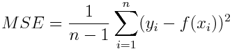
    
- R squared (r2)

    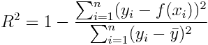
    
- Penalized Residual Sum of Squares (prss)

    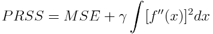
    
- Variance normalized - Penalized Residual Sum of Squares (vnprss)
    
    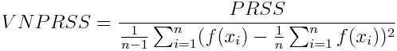
    
- F statistic (fstat)

    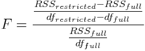
    
- F test (ftest)

    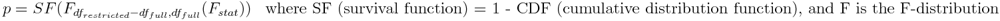
    
- Akaike Information Criterion (aic)

    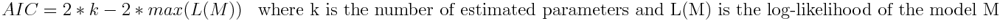

#### Methods to compare between statistical maps
You can also compare between statistical maps with up to four different techniques:

- RGB: each map is put as RGB channel, so you can compare between 2 and 3 maps by looking at the colour of the 
resulting map at each region

- Best model: for each voxel the highest value is picked, and that produces a map with the highest values for all 
compared statistical maps, and also a map with the labels of the maps that had the highest value at a particular voxel

- Absolute difference: absolute difference between 2 statistical maps

- SE: squared error between 2 statistical maps


#### Curve visualization

This software allows you to visualize the fitted curves, with the option to overlap several of them so that you can 
visually compare them.

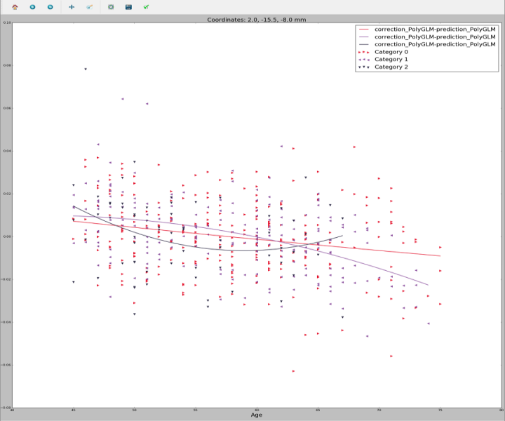

#### Graphical curve visualization

On top of the previously mentioned curve visualization functionality this software offers an FSLView-like tool:  
you can load any statistical map and several of the fitting results you may have previously 
computed, and it shows you the curves for the selected voxel, allowing you to navigate through the statistical map
and see the curves for each voxel. 

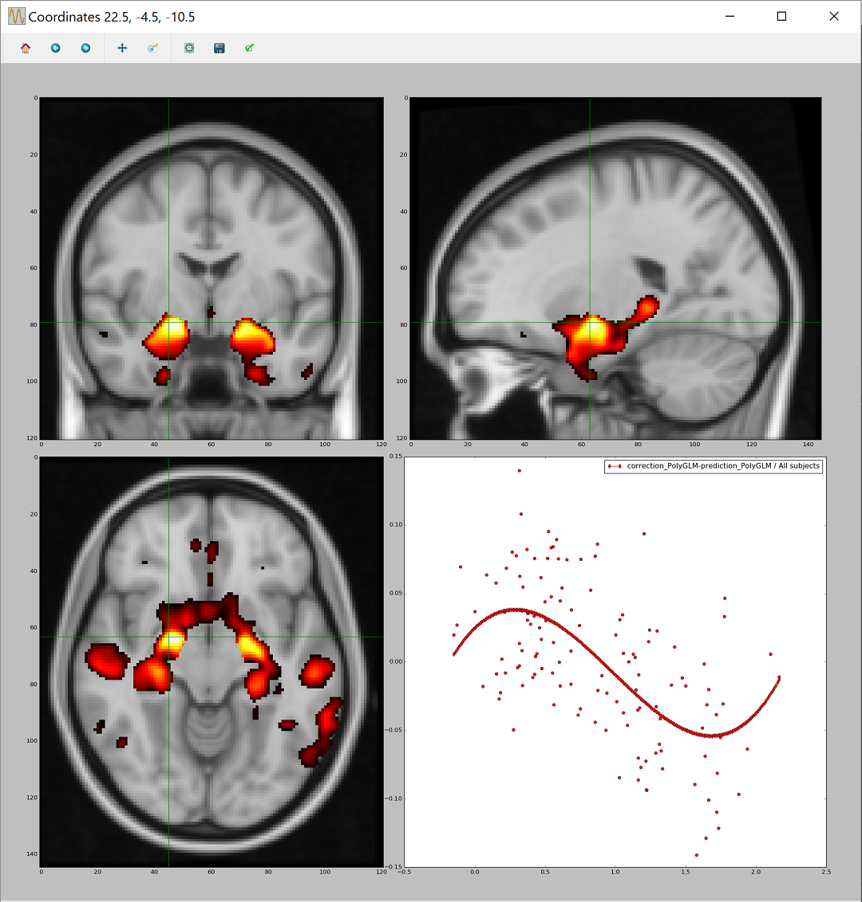

#### Hyperparameters finder

Some of the fitters depend on hyperparameters, in particular the Support Vector Regression fitters depend on the 
epsilon, the C and, in the case of GaussianSVR, the gamma. In order to find optimal hyperparameters to fit the data
of your study, this software incorporates a **GridSearch** based approach. 

The error function that the GridSearch algorithm tries to minimize can be picked among these:

- MSE

- Cp statistic

- ANOVA-based error

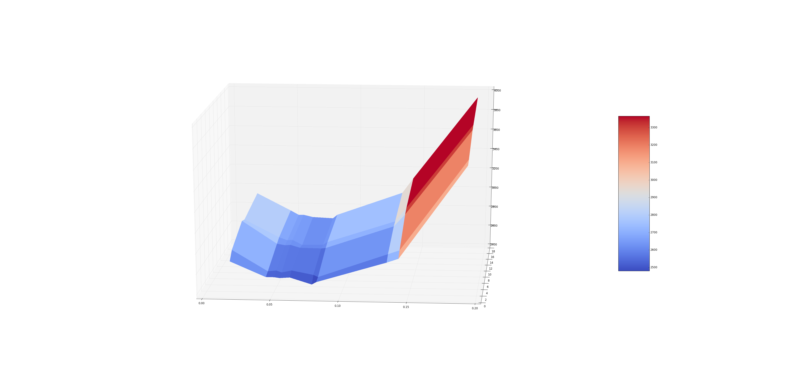


#### Data and residuals distribution plots

Another useful feature included in this software is the ability to plot univariate or bivariate distributions of the 
data or the residuals, as well as box plots, both for all subjects or to compare between categories.

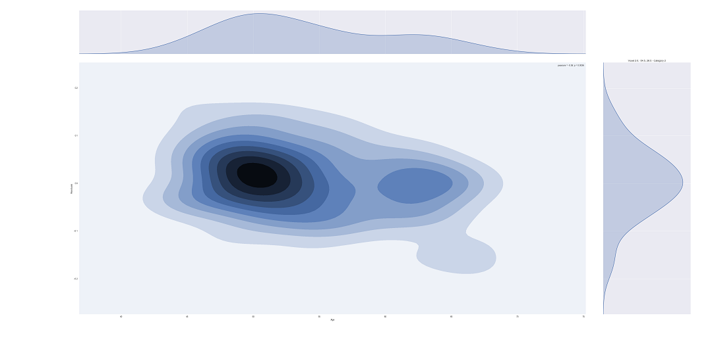 


#### Categorical comparison

The toolbox allows the user to separate the predictor by categories in order
to compute one vs all statistical tests. 


## Requirements

In order for this toolbox to properly parse and obtain the data to be processed there are some requirements that should
 be fulfilled. These requirements are the following: 

- **Excel file (.xls)** with all the metadata.

    This file should contain the unique identifier for each subject, an optional 
    categorical value for each subject, and one or several fields with metadata to be used as predictor and/or correctors.
    The data must be enclosed in the first sheet of the xls book, and this sheet must have the first row as a header with 
    the names identifying the fields to be used. 
    An example of a Excel file with the required format can be found in `tests/mock_data/mock_excel.xls`.

    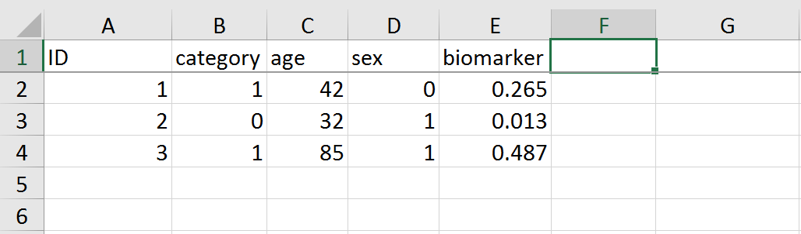
    

- **Folder** containing all the **NIFTIs** (gzipped or not).

    This folder must containt one NIFTI file for each subject, and it should be identified with the unique
    identifier specified in the excel file, with the option to have a study prefix for everyone of them.
    
    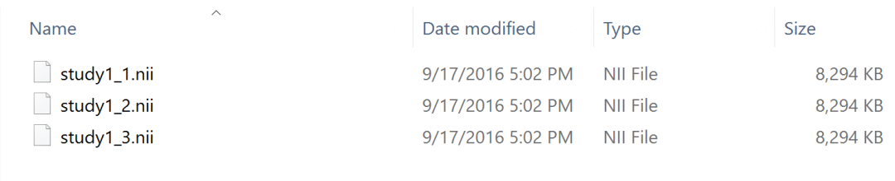
    
- **Template** file in NIFTI format.

    The template into which all the subjects have been registered (for instance, to compute the VBM
    in MNI space).
    
    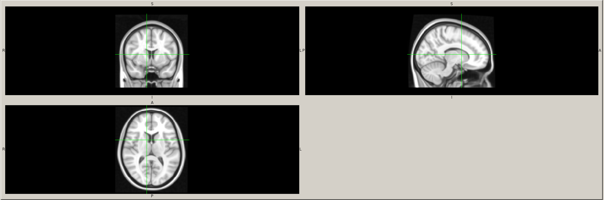

- **Configuration file (.yaml)** for this study.

    In this configuration file you specify where to find your previous requirements (Excel, data folder and template),
    where to store the results, the model (predictor and correctors), and other parameters, such as the processing
    parameters and the configuration parameters for the _GridSearch_.
    
    You can find a template of this configuration file in `config/exampleConfig.yaml`.
    
    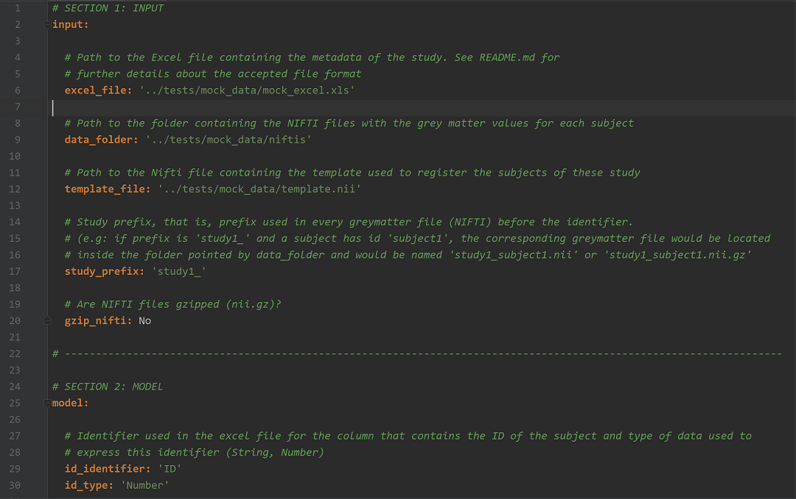
   

## How can I use it?

The interaction between the user and the software is done through a Command Line Interface (CLI). 

As the toolbox is written in Python you must have **python 2.7** previously 
installed in order to use it (instructions on how to install python can be found 
[here](https://www.python.org/downloads/)).

First you just have to clone this repository:
```
$ git clone https://github.com/imatge-upc/VNeAT.git
$ cd VNeAT
```
After that you must install all the dependencies, specified in the __requirements.txt__ file:
```
$ pip install -r requirements.txt
```
After all that is done you can execute the scripts using the python executable. 
This is the pattern that you'll be using to execute the scripts:
```
$ python vneat-script.py config_file --options
```

## CLI documentation

#### vneat-compute_fitting.py

*Computes the fitting parameters for the data provided in the configuration file. 
These fitting parameters can be computed for all subjects in the study (default behaviour)
or you can specify for which categories should the parameters be computed* 

| Parameter name | Optional | Possible value/s | Default value | Description |
| :---: | :---: | :---: | :---: |  :---: |
| configuration_file | No | Path  | - | YAML configuration file for the study, as specified in the requirements section |
| --categories | Yes | Space-separated integers | None  | Category or categories (as they are represented in the Excel file) for which the fitting parameters should be computed |
| --parameters | Yes | Path | None | Path to the txt file within the results directory that contains the user defined parameters to load a pre-configured correction and prediction processor |
| --prefix | Yes | String | Empty string | Prefix used in the result files |

#### vneat-generate_user_parameters.py

*Generates user defined parameters for a specific correction and prediction processor
so you can use them in compute_fitting.py using the --parameters option* 

| Parameter name | Optional | Possible value/s | Default value | Description |
| :---: | :---: | :---: | :---: |  :---: |
| configuration_file | No | Path  | - | YAML configuration file for the study, as specified in the requirements section |
| --prefix | Yes | String | Empty string | Prefix used in the result files |

#### vneat-compute_statistical_maps.py

*Computes statistical maps for the fitting results computed by compute_fitting.py. 
By default uses all computed parameters inside the results folder specified 
in the configuration file.* 

| Parameter name | Optional | Possible value/s | Default value | Description |
| :---: | :---: | :---: | :---: |  :---: |
| configuration_file | No | Path  | - | YAML configuration file for the study, as specified in the requirements section |
| --method | Yes | mse, r2, fstat, ftest, aic, prss, vnprss | ftest | Method to evaluate the fitting score per voxel and create a statistical map out of these fitting scores |
| --dirs | Yes | Space-separated paths | All computed parameters within the results directory | Specify one or several directories within the results directory from which the parameters should be loaded |
| --cluster_size | Yes | Integer | 100 | Value of the minimum cluster size (in voxels) that should survive after thresholding |
| --p_thresholds | Yes | Space-separated floats | 0.01 0.005 0.001 | One or more values representing the maximum acceptable p-value, so that all voxels with greater p-value are put to the default value |
| --gamma | Yes | Float | 5e-3 | Value of the percentile used to determine the upper threshold for PRSS and vnPRSS methods |
| --gm_threshold | Yes | Float | 0.1 | Mean grey-matter lower threshold |
| --labels | Yes | Boolean | True | Produce a map that has one label per cluster |

#### vneat-compare_statistical_maps.py

*Compares statistical maps generated by compute_statistical_maps.py using four possible 
techniques: RGB map, best-fitting map, absolute difference or squared error. 
You must specify the specific maps to compare and ensure that they 
are comparable (Z-score map vs Z-score map, p-value map vs p-value map, etc.)*

| Parameter name | Optional | Possible value/s | Default value | Description |
| :---: | :---: | :---: | :---: |  :---: |
| configuration_file | No | Path  | - | YAML configuration file for the study, as specified in the requirements section |
| files | No | Space-separated paths | - | Specify two or more files within the results directory to be compared |
| --method | Yes | best, rgb, absdiff, se | best | Method to compare the fitting score per voxel and create a new statistical map out of this comparison |
| --name | Yes | String | Empty string | Name to be prepended to the output file |

#### vneat-search_hyperparameters.py

*Finds the hyper parameters of the PolySVR or GaussianSVR 
using a grid search approach and using several error functions*

| Parameter name | Optional | Possible value/s | Default value | Description |
| :---: | :---: | :---: | :---: |  :---: |
| configuration_file | No | Path  | - | YAML configuration file for the study, as specified in the requirements section |
| --parameters | Yes | Path | None | Path to the txt file within the results directory that contains the user defined parameters to load a pre-configured correction and prediction processor |
| --categories | Yes | Space-separated integers | None  | Category or categories (as they are represented in the Excel file) for which the hyperparameters should be found |
| --prefix | Yes | String | Empty string | Prefix used in the result files |
| --error | Yes | mse, anova, Cp | anova | Error function to be minimized in order to find the optimal hyperparameters |
| --iterations, -i | Yes | Integer | 5 | The number of iterations to perform |
| --voxels, -v | Yes | Integer | 100 | The number of voxels to be used to compute the error and therefore find the optimal hyperparameters. In general, more voxels used may imply better generalization, but also more computation time and use of resources |
| --voxel-offset | Yes | Integer | 10 | Number of voxels that will not be taken into account in all directions, both at the beginning and at the end. That is, for a voxel offset of v, and volumes with dimensions (x_dim, y_dim, z_dim), only the following voxels will be taken into account: [v:x_dim-v, v:y_dim-v, v:z_dim-v] |

#### vneat-show_curves.py

*Shows the curves for the fitting results computed by compute_fitting.py. 
By default shows all computed parameters inside the results folder specified in the 
configuration file*

| Parameter name | Optional | Possible value/s | Default value | Description |
| :---: | :---: | :---: | :---: |  :---: |
| configuration_file | No | Path  | - | YAML configuration file for the study, as specified in the requirements section |
| --dirs | Yes | Space-separated paths | All computed parameters within the results directory | Specify one or several directories within the results directory from which the parameters should be loaded |
| --compare | Yes | Boolean | True | Plots the curves in the same figure so that you are able to compare the different curves. The program does not recognize whether the data has been corrected with the same fitter or not, so you must ensure this to have coherent results |

#### vneat-show_visualizer.py

*Shows the graphical visualizer to display a statistical 
map and the curves for the selected voxel*

| Parameter name | Optional | Possible value/s | Default value | Description |
| :---: | :---: | :---: | :---: |  :---: |
| configuration_file | No | Path  | - | YAML configuration file for the study, as specified in the requirements section |
| map | No | Path | - | Path relative to the output directory specified in the configuration file to the statistical map to be loaded |
| dirs | No | Space-separated paths | - | Specify one or more directories within the results directory specified in the configuration file from which the fitting parameters should be loaded |
| --colormap | Yes | hot, rainbow | hot | Color map used to paint the statistical maps' values. By default it is 'hot', useful for statistical based measures (F-stat, p-values, Z-scores, etc.), but you can use 'rainbow' for labeled maps |
| --n-points | Yes | Integer | 100 | Number of points used to plot the curves. More points means a smoother curve but requires more computational resources |

#### vneat-show_data_distribution.py

*Shows the data distribution of the observations, the predictors, 
the correctors and the residuals*

| Parameter name | Optional | Possible value/s | Default value | Description |
| :---: | :---: | :---: | :---: |  :---: |
| configuration_file | No | Path  | - | YAML configuration file for the study, as specified in the requirements section |
| plot | No | univariate_density, bivariate_density, boxplot, categorical_boxplot | - | Type of plot to be used. For the categorical_boxplot it is assumed that the dirs specified belong to different categories of the data. Otherwise, only the last data retrieved from a specific category will be taken into account |
| --dirs | Yes | Space-separated paths | All computed parameters within the results directory | Specify one or several directories within the results directory from which the parameters should be loaded |

____
You can get help about the required parameters using the `--help` option, which is supported by all the scripts.

For example, if you want to know how to execute the *vneat-show_visualizer.py* script, you can use:
```
$ python vneat-show_visualizer.py --help
```
